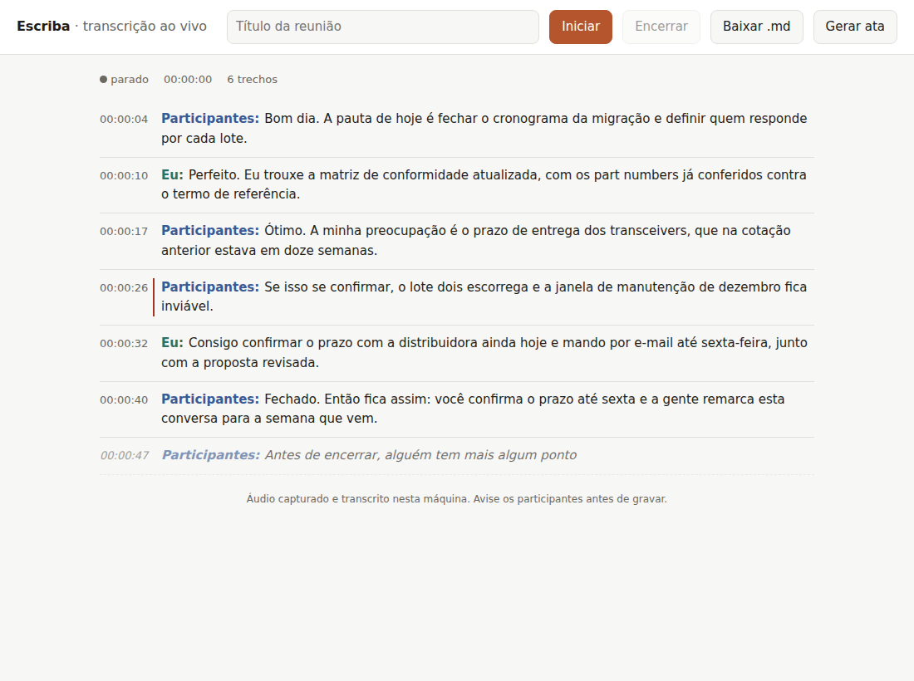
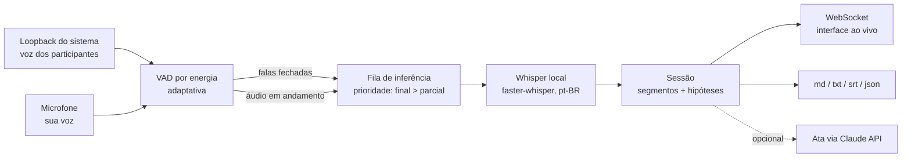

# Escriba

Transcrição de reuniões **em tempo real**, em **português do Brasil**, **sem colocar
bot nenhum na sala**. Funciona com Microsoft Teams, Cisco Webex e Google Meet — e com
qualquer outro aplicativo, porque o Escriba não fala com a reunião: ele escuta o áudio
que já passa pela sua máquina.

```
Você entra na reunião normalmente.
       │
       ├── o que os outros falam  ──► loopback do sistema ──┐
       └── o que você fala        ──► microfone ────────────┤
                                                            ▼
                                          VAD (recorta as falas)
                                                            ▼
                                       Whisper local (pt-BR, na sua máquina)
                                                            ▼
                            transcrição ao vivo + .md/.txt/.srt/.json + ata opcional
```

Nada é enviado para fora do computador durante a reunião. A única etapa remota é a
geração da ata pela Claude API, que é opcional e só acontece quando você clica.

---

## Por que sem bot

A rota mais divulgada para transcrever reuniões é subir um participante robô que entra
na sala e grava. Ela custa caro em três moedas: o bot aparece na lista de participantes
(e em muitas empresas é barrado por política), depende de uma integração diferente para
cada plataforma, e manda o áudio para um serviço de terceiros.

O Escriba troca isso por um ponto de captura mais simples: o próprio sistema de áudio da
máquina de quem já está na reunião. Consequências práticas:

| | Com bot | Escriba (loopback local) |
|---|---|---|
| Aparece na reunião | sim | não |
| Integração por plataforma | uma para cada | nenhuma — é indiferente ao aplicativo |
| Precisa de permissão de TI | quase sempre | não, é áudio local |
| Áudio sai da máquina | sim | não |
| Grava reunião de terceiros que você não está | sim | não |
| Distingue cada pessoa pelo nome | às vezes | não (veja [Limitações](#limitações-conhecidas)) |

As APIs oficiais das três plataformas **não** oferecem transcrição ao vivo sem bot —
Teams, Webex e Meet entregam o transcript depois do fim da reunião. O levantamento está
em [`docs/plataformas.md`](docs/plataformas.md).

---

## Requisitos

* Python 3.11 ou superior
* Uma fonte de áudio de loopback (a instalação varia por sistema — veja abaixo)
* Para o modelo grande em tempo real: GPU NVIDIA. Sem GPU, use um modelo menor.

## Instalação

```bash
git clone <este-repositório> && cd portifolio
python -m venv .venv && source .venv/bin/activate   # Windows: .venv\Scripts\activate
pip install -e ".[local,web]"                        # transcrição local + interface web
pip install -e ".[local,web,ata]"                    # com ata pela Claude API
```

No Windows, some `[windows]` para o loopback nativo:

```bash
pip install -e ".[local,web,windows]"
```

Antes de tudo, confirme que o pipeline está de pé — este comando não usa microfone,
modelo nem rede:

```bash
escriba autoteste
```

---

## Captura por sistema operacional

Esta é a única parte que muda de máquina para máquina. Rode `escriba dispositivos` para
ver o que o Escriba enxerga; as fontes de loopback aparecem marcadas.

### Linux (PulseAudio / PipeWire) — nada a instalar

Toda saída de áudio tem uma fonte `.monitor` correspondente, que já é uma entrada
comum. O Escriba encontra sozinho a do dispositivo padrão:

```bash
pactl list sources short | grep monitor    # conferência manual
escriba servir
```

### Windows — loopback WASAPI

O WASAPI grava o que está tocando sem cabo virtual e sem mexer no roteamento de áudio.
Em Python isso vem do PyAudioWPatch, um fork do PortAudio com suporte a loopback:

```bash
pip install -e ".[local,web,windows]"
escriba servir
```

Alternativa sem componente nativo: instale o [VB-CABLE](https://vb-audio.com/Cable/),
mande a saída da reunião para ele e escolha `CABLE Output` como dispositivo do sistema.
O preço é que você precisa duplicar a saída para continuar ouvindo.

### macOS — dispositivo virtual

O macOS não expõe o áudio de outros aplicativos para um processo comum sem API
privilegiada. O caminho prático é um driver virtual:

```bash
brew install blackhole-2ch
```

Depois, no **Configuração de Áudio e MIDI**, crie um *dispositivo agregado* com o
BlackHole **e** a sua saída normal, e use-o como saída do sistema — assim o Escriba
grava e você continua ouvindo a reunião. Aponte a captura para o BlackHole:

```bash
escriba --config escriba.toml servir     # com system_device = "BlackHole"
```

---

## Uso

### Interface web ao vivo

```bash
escriba servir            # abre em http://127.0.0.1:8777
```



A transcrição aparece linha a linha enquanto a reunião acontece: hipóteses provisórias
em itálico, trechos fechados em texto normal, com marca lateral nos trechos em que o
modelo ficou inseguro. Os botões dão conta de iniciar, encerrar (salva em disco), baixar
o `.md` e gerar a ata.

### Terminal

```bash
escriba gravar --titulo "Reunião de kickoff"    # Ctrl+C encerra e salva
escriba gravar --so-sistema                     # ignora o seu microfone
```

### Gravações que você já tem

```bash
escriba arquivo reuniao.wav --falante "Cliente"
# outros formatos: ffmpeg -i reuniao.m4a -ac 1 -ar 16000 -c:a pcm_s16le reuniao.wav
```

### Ata, decisões e itens de ação

```bash
export ANTHROPIC_API_KEY=...        # ou: ant auth login
escriba ata transcricoes/2026-09-05_1430_reuniao-de-kickoff.json
```

Sai um markdown com resumo, decisões, tabela de itens de ação (ação / responsável /
prazo) e pontos em aberto. Só esta etapa envia dados para fora da máquina, e o que sai é
o texto já transcrito — nunca o áudio.

---

## Configuração

Copie `escriba.example.toml` para `escriba.toml` e ajuste o que precisar; tudo tem
padrão. Variáveis de ambiente (`ESCRIBA_MODEL`, `ESCRIBA_SYSTEM_DEVICE`, `ESCRIBA_PORT`,
…) têm precedência sobre o arquivo.

Os três ajustes que mais mudam o resultado:

* **`asr.model`** — `large-v3` é o melhor em português; `small` é o que roda em tempo
  real numa CPU comum. Comece pelo `small`, suba se a máquina aguentar.
* **`vad.speech_margin_db`** — aumente se o ruído da sala estiver abrindo falas
  fantasma; diminua se falas baixas estiverem passando batido.
* **`asr.initial_prompt`** — a lista de termos que o modelo tende a acertar. Coloque as
  siglas, nomes de produto e jargão do seu contexto; é o ajuste mais barato de todos.

### Desempenho

O Escriba informa, ao encerrar, quantos segundos de processamento gastou por segundo de
áudio (`0.42× tempo real`, por exemplo). Abaixo de `1.0×` a transcrição acompanha a
reunião; acima disso a fila atrasa e as hipóteses parciais começam a ser descartadas —
sinal de que é hora de descer o modelo ou ligar a GPU. Meça na sua máquina em vez de
confiar em tabela: o número varia demais com CPU, GPU e `compute_type`.

---

## Como funciona



Quatro decisões explicam o resto do código:

1. **Duas trilhas separadas, não uma mistura.** Microfone e loopback são capturados em
   paralelo. Além de melhorar o reconhecimento (cada trilha tem seu próprio piso de
   ruído), isso dá de graça a separação entre "Eu" e "Participantes", sem diarização.
2. **O VAD decide o que vai para o modelo.** O Whisper trabalha muito melhor com uma
   frase inteira do que com pedaços de 300 ms. O detector recorta as falas por silêncio,
   guarda 300 ms antes do início (para não comer a primeira sílaba) e corta monólogos
   em blocos de 25 s.
3. **Uma única thread de inferência.** O modelo é caro demais para instanciar duas
   vezes. A fila é por prioridade: trecho fechado passa na frente de hipótese parcial, e
   parcial que ficou para trás é descartada em vez de transcrita — é isso que segura a
   latência quando duas pessoas falam ao mesmo tempo.
4. **`condition_on_previous_text=False`.** Realimentar o texto anterior é a origem
   clássica dos loops de repetição do Whisper, e em reunião com várias vozes o efeito é
   pior ainda.

Detalhamento em [`docs/arquitetura.md`](docs/arquitetura.md).

---

## Limitações conhecidas

Coisas que este projeto **não** faz, para você não descobrir no meio de uma reunião:

* **Não distingue os participantes pelo nome.** A separação é por origem do áudio: você
  de um lado, todos os outros do outro. Diarização por voz dentro da trilha remota é
  possível (pyannote), mas custa GPU e latência, e continua rotulando "Falante 1" em vez
  de "Ana" — está no roteiro, não no código.
* **Não grava reunião em que você não está.** É consequência direta do modelo: sem bot,
  a captura depende de alguém presente na sala.
* **Fone de ouvido ajuda muito.** Na caixa de som, sua voz volta pelo loopback e aparece
  duplicada nas duas trilhas. O cancelamento de eco entre trilhas não está implementado.
* **Números, siglas e nomes próprios erram mais.** Use `asr.initial_prompt` e revise a
  transcrição antes de tratá-la como registro formal.
* **A hipótese parcial muda enquanto você lê.** É o comportamento esperado: ela é
  refeita a cada ciclo e substituída pelo texto definitivo quando a fala fecha.

## Sobre gravar reunião

Gravar uma conversa da qual você participa é lícito no Brasil, mesmo sem o conhecimento
dos demais (STF, RE 583.937). Isso resolve a questão penal, não a profissional nem a de
proteção de dados: a transcrição de uma reunião contém dados pessoais e entra no escopo
da LGPD assim que você a armazena ou compartilha.

O que este projeto recomenda, e o que ele já faz por você:

* **Avise os participantes** antes de começar. É um segundo de conversa e evita todo o
  resto.
* Verifique a política do seu empregador e do cliente — várias proíbem gravação sem
  registro formal, independentemente da lei.
* O áudio nunca sai da máquina, e o arquivo fica em `transcricoes/` sob seu controle:
  retenção e descarte são decisão sua.
* A ata pela Claude API é a única etapa que envia texto para fora, é opcional e explícita.

## Desenvolvimento

```bash
pip install -e ".[dev]"
pytest          # 65 testes, sem hardware de áudio e sem baixar modelo
ruff check src tests
```

A suíte roda com áudio sintético e um motor de transcrição falso (`--motor mock`), então
ela exercita captura, VAD, fila de inferência, servidor e exportação em qualquer máquina,
inclusive em CI sem placa de som.

## Roteiro

- [ ] Diarização opcional dentro da trilha remota (pyannote), atrás de uma flag
- [ ] Cancelamento de eco entre microfone e loopback, para quem usa caixa de som
- [ ] Glossário por reunião, aplicado como correção posterior além do `initial_prompt`
- [ ] Motor alternativo com WhisperX, para alinhamento por palavra mais preciso
- [ ] Empacotamento como aplicativo de bandeja (Windows/macOS)

## Licença

MIT.
